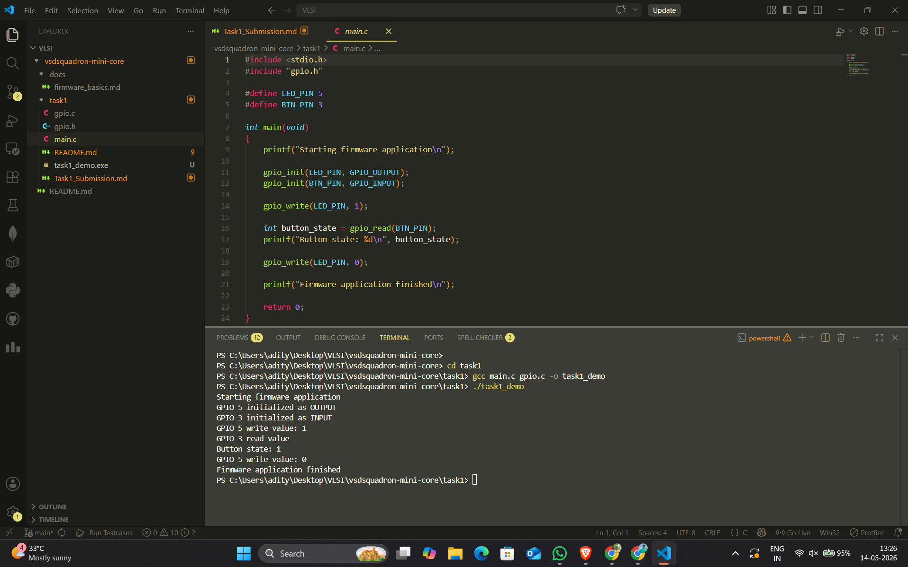

# Task 1: Firmware Foundations & Environment Setup

1) What is a firmware library?
A firmware library is basically a collection of pre-written code that acts as a bridge between the high-level application we write and the raw hardware of the microcontroller. It can be seen as a sort of translator. Instead of forcing us to talk to the hardware using complex memory addresses and raw registers, the library gives us simple and easy to use functions. It does all the heavy lifting in the background so we can focus on the actual logic of the project rather than getting stuck on how to manually flip a specific hardware switch.

**Figure 1: The Firmware Abstraction Stack**
```mermaid
graph TD
    A[main.c / Application Code] -->|Calls API: gpio_write| B[gpio.c / Firmware Library]
    B -->|Writes bits to memory: 0x40020014| C[RISC-V Hardware / Registers]
    
    classDef app fill:#e1f5fe,stroke:#01579b,stroke-width:2px,color:#000;
    classDef lib fill:#e8f5e9,stroke:#1b5e20,stroke-width:2px,color:#000;
    classDef hw fill:#ffebee,stroke:#b71c1c,stroke-width:2px,color:#000;
    
    class A app;
    class B lib;
    class C hw;

2) Why are APIs important in embedded systems?
APIs are really important because they bring structure and abstraction to embedded development. Hardware is naturally complicated, but an API lets us write simple commands like gpio_write instead of hardcoding messy hexadecimal memory locations. Another big reason is portability. If we ever switch to a completely different microcontroller, the underlying hardware registers will change, but our main application logic can stay exactly the same. We would just need to swap out the library behind the API. It also makes the code much easier to read and share with others.

**Figure 2: API Portability**
```mermaid
graph TD
    App[Core Application Logic]
    API{Hardware Abstraction API<br/>e.g., gpio_write}
    
    App --> API
    API -.->|Swap Library| R[RISC-V Chip]
    API -.->|Swap Library| A[ARM Cortex Chip]
    API -.->|Swap Library| E[AVR / Arduino Chip]

    style App fill:#f3e5f5,stroke:#4a148c,stroke-width:2px,color:#000;
    style API fill:#fff3e0,stroke:#e65100,stroke-width:2px,color:#000;

3) What was understood from the lab code?
The lab code really helped me understand the concept of separation of concerns. In the project, main.c acts as the application layer. It just sends high-level commands, like turning on an LED or reading a button, without needing to know how the hardware actually performs those tasks. On the flip side, gpio.c acts as the firmware library or API. Right now, it is just simulating these hardware interactions by printing messages to the console. But when we get the actual RISC-V board, we will only need to replace those print statements in gpio.c with real hardware register operations. Because this API is in place, the code in main.c won't have to change at all.

Lab Execution Screenshots

Here is the screenshot of my terminal showing both the compilation and the program output:



