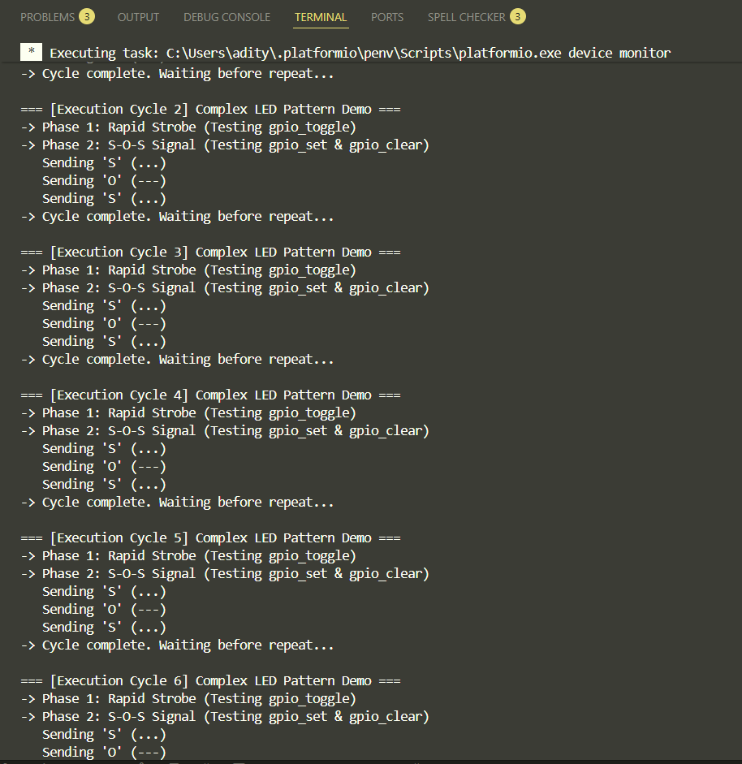

# Task 3 Evidence: Advanced GPIO Library

## 1. Application Hardware Execution

**Hardware Verification**:
> *(The demo requires no jumping wires. It proves Input `gpio_read()` works by verifying internal pull-up and pull-down states mathematically matching expected logic. It proves Output functions `gpio_set()`, `gpio_clear()`, and `gpio_toggle()` by enacting a complex 2-Phase pattern (Strobe + S-O-S Morse Code) on the Onboard LED.)*

**Video / Photo Link**:
> *(Click the link below to watch the video showing the VSDSquadron Mini board powered on, with the onboard LED (PD6) physically displaying the Rapid Strobe followed by the S-O-S morse code pattern).*

[🎥 Watch Hardware Execution Video](./Task3_HW_evidence.mp4)

## 2. UART Logs

**Explanation**:
> *(The logs below prove that the C code correctly read the internal pull-up/pull-down states without a wire attached to PC4. The logs also correctly trace the looping behavior of the detailed LED sequence outputting to PD6).*

**Screenshot**:
> *(Screenshot of PlatformIO serial monitor showing the Input test and full cycle of the Pattern output).*



**Raw Log Output**:

```text

System Initialized.
Starting Advanced GPIO Demo (Wire-Free Mode)...

--- Testing GPIO Input (Read) API ---
PC4 Configured as PULL-UP. Read State: HIGH (Expected: HIGH)
PC4 Configured as PULL-DOWN. Read State: LOW (Expected: LOW)

--- Testing GPIO Output APIs (LED Pattern) ---

=== [Execution Cycle 1] Complex LED Pattern Demo ===
-> Phase 1: Rapid Strobe (Testing gpio_toggle)
-> Phase 2: S-O-S Signal (Testing gpio_set & gpio_clear)
   Sending 'S' (...)
   Sending 'O' (---)
   Sending 'S' (...)
-> Cycle complete. Waiting before repeat...

=== [Execution Cycle 2] Complex LED Pattern Demo ===
-> Phase 1: Rapid Strobe (Testing gpio_toggle)
-> Phase 2: S-O-S Signal (Testing gpio_set & gpio_clear)
```
