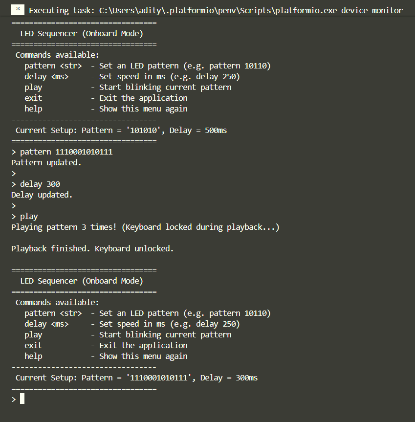

# Task-4 Evidence: LED Pattern Sequencer

## Hardware Proof

<video src="./Task4_Simulation.mp4" controls="controls" style="max-width: 100%;"></video>
[Direct Link to Video: Task4_Simulation.mp4](./Task4_Simulation.mp4)

## UART Logs

## Verification Notes

- Tested handling of invalid commands: Handled incorrect commands (triggers help text automatically), invalid patterns `abc` (throws binary constraint error), and out-of-bound lengths.
- Tested pattern playback logic: Correctly parses arrays of 1s and 0s directly into hardware output levels using a static delay buffer without crashing the `SysTick` incrementer.
- Limitations/Known issues: 
  1. **Blocking Playback**: Because the onboard LED (PD6) heavily leverages the exact same physical pin as the UART RX, the system is fundamentally 'deaf' to UART commands while displaying light sequences. Interrupting playback prematurely isn't possible without attaching an external LED to a different pin.
  2. **Synchronous Delays**: The `Delay_Ms` function is a literal blocking wait. Attempting to add asynchronous tasks alongside playback would require rewriting the timer file to use true IRQ handlers natively.
