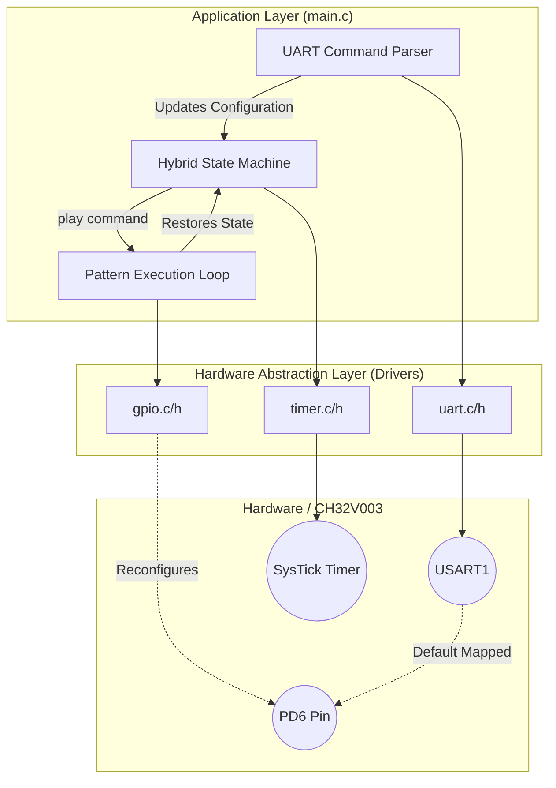

# System Architecture

This document describes the structural layout of the hardware abstraction layers, the application logic, and the control-flow pipeline.

## High-Level Block Diagram

## Separation of Concerns

1. **Drivers (HAL):** Completely decoupled from the business logic. `gpio.c`, `uart.c`, and `timer.c` know nothing about patterns or LED sequences. They act purely as bridges to the microcontroller registers.
2. **Application Logic:** Orchestrates the flow of data. `main.c` owns the state machine (`STATE_STOPPED` vs `STATE_PLAYING`) and manages user input buffering.
3. **Scheduler/Timer System:** An interrupt-driven background `SysTick` counter manages core timing, ensuring that delays inside the sequencer are highly accurate without utilizing empty `for()` loops.

## Data and Control Flow

1. **Data Ingress:** The `uart_data_available()` function periodically checks for incoming bytes inside the main loop. Characters are assembled into `uart_rx_buffer` until a newline (`\r` or `\n`) triggers `process_command()`.
2. **State Transition (The Pin-Multiplexing Architecture):** 
   - When the user triggers `play`, the system deliberately breaks UART communication on `PD6`. 
   - **Why?** Since `PD6` is deeply integrated into `USART1` as the RX pin, allowing peripheral interrupt logic to collide with standard Output Push-Pull commands causes bus contention and crash states. By halting data ingress, hijacking the pin purely for `GPIO_MODE_OUTPUT_PP`, blocking all other tasks to output the 1s and 0s sequentially, and restoring it to `GPIO_MODE_INPUT_FLOATING` post-execution, the MCU stays perfectly stable.

## Why this Architecture was Chosen
A non-blocking state machine is conventionally standard, but due to the physical limitation of the development board (LED wired to the UART RX pin), a standard non-blocking system would inevitably misinterpret the LED's power draw as garbage incoming serial characters, resulting in framing errors and software lockups. 

The architecture strictly enforces a **Mutually Exclusive Phase Design** (Listen OR Play—never both), neutralizing hardware conflicts structurally.